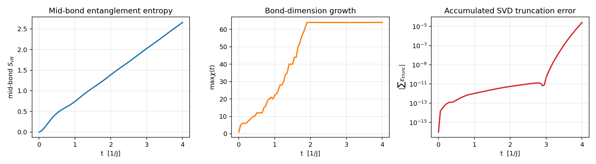
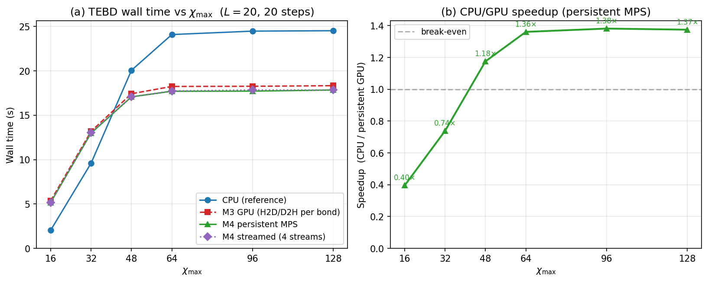
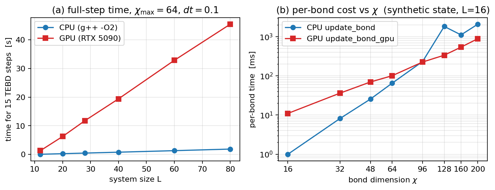
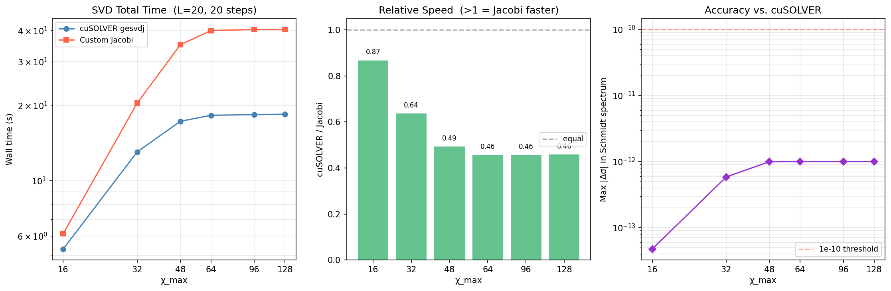
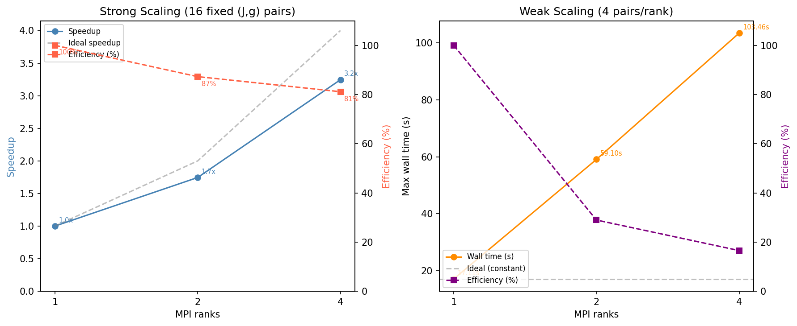
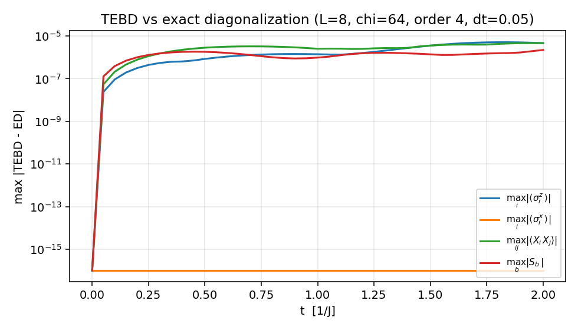

# GPU-Accelerated TEBD for the 1D Transverse-Field Ising Model

**Final Report -- CME 213: Parallel Computing with CUDA, MPI and OpenMP**  
**Team members:** Hercy Shen, Chiling Han, Xin Wei  
**Date:** June 8, 2026

**Hardware and software.** The final multi-GPU experiments were run on the
course `gpu-turing` partition with NVIDIA Quadro RTX 6000 GPUs (Turing
`sm_75`, 24 GB), NVHPC 24.1, CUDA 12.3, and OpenMPI, with one GPU assigned to
each MPI rank. Single-GPU kernel development and the CPU/GPU crossover study
also used a local NVIDIA RTX 5090 (`sm_120`, 32 GB, CUDA 12.9). The CPU
baseline is C++14 built with `g++ -O2` on one host core. The code is organized
as a CPU reference library in `src/core`, a CUDA backend in `src/gpu`, driver
and benchmark programs in `src/apps`, Google Test regression tests in
`src/tests`, and plotting/Slurm scripts in `src/scripts`. It is a from-scratch
C++14/CUDA/MPI implementation: the CPU reference uses hand-written tensor
operations, GEMM/GEMV, SVD, and matrix exponential routines, while the
production GPU path uses cuSOLVER only for the SVD bottleneck so that the
surrounding kernels and data movement remain visible to profiling.

---

## 1. Project Description

We simulate real-time quench dynamics of the one-dimensional transverse-field
Ising model (TFIM),

$$
H = -J \sum_i \sigma^x_i \sigma^x_{i+1} - g \sum_i \sigma^z_i .
$$

An `L`-site spin-1/2 chain has a Hilbert space of size `2^L`, so exact
state-vector simulation becomes impractical after roughly `L = 30`. The
physical structure that makes larger 1D simulations possible is entanglement:
many short-time states of local 1D Hamiltonians can be represented accurately
by a Matrix Product State (MPS), which stores the wavefunction as a chain of
rank-3 tensors connected by bond indices. The storage cost is
`O(L chi^2 d)` rather than `O(d^L)`, where `d = 2` and the bond dimension
`chi` measures how much entanglement crosses each cut.

The computation is Time-Evolving Block Decimation (TEBD). We approximate
`exp(-i H t)` with a Suzuki-Trotter product of nearest-neighbor two-site gates.
Each time step applies `L - 1` gates. Applying one gate means building a
two-site tensor, reshaping it into a small complex matrix, computing an SVD,
truncating to `chi_max`, and restoring MPS form. That SVD is the hot operation:
in the final GPU implementation, cuSOLVER Jacobi SVD kernels account for more
than 99.6% of GPU kernel time.

The program inputs are `L`, couplings `(J, g)`, initial product state, time
step `dt`, number of steps, maximum bond dimension `chi_max`, Trotter order,
and truncation tolerance. The outputs are magnetizations
`<sigma^z_i>` and `<sigma^x_i>`, two-point correlations
`<sigma^x_i sigma^x_j>`, bipartite entanglement entropy on each cut, the
active bond-dimension profile, and accumulated truncation error. We assume open
boundaries, local dimension `d = 2`, and nearest-neighbor interactions.

Multi-GPU parallelism is needed because the scientific use case is not one
isolated quench, but a sweep over a phase diagram: many independent `(J, g)`
points, bond dimensions, and time-step choices. As entanglement grows, the
active bond dimension grows and the per-bond cost scales roughly as
`O(chi^3)`. A single GPU accelerates one evolution once `chi` is large enough;
MPI across GPUs turns the parameter sweep into a tractable wall-clock workload.

*Figure 1. Reference TFIM quench (`L = 20`, `J = g = 1`, order 4,
`chi_max = 64`). Entanglement growth drives bond-dimension growth, and the
active bond dimension determines the SVD size that dominates runtime.*

---

## 2. Algorithms and State of the Art

The core representation is a right-canonical MPS in Vidal B-form. Each site
stores a tensor `B_i(chi_L, d, chi_R)`, and each bond stores its Schmidt
spectrum `S_i`. This form is convenient for TEBD because truncation after a
two-site SVD is local and directly exposes the entanglement entropy.

One TEBD bond update is:

1. Build the two-site tensor `Theta` from the neighboring MPS tensors and the
   left Schmidt spectrum.
2. Contract a two-site gate with the physical indices of `Theta`.
3. Reshape to a matrix of size `(chi_L d) x (d chi_R)`.
4. Compute `Theta = U diag(S) V^H`.
5. Keep the largest singular values up to `chi_max`, renormalize, and restore
   the two site tensors in Vidal form.

The `TEBDEngine` precomputes all local gates and supports first-order,
second-order symmetric, and fourth-order Forest-Ruth Trotter schedules. The CPU
reference in `src/core` is intentionally written without LAPACK, Eigen, or
OpenBLAS: GEMM, GEMV, tensor contraction, matrix exponential, and one-sided
Jacobi SVD are hand-written so the algorithmic pieces are visible and portable
to CUDA. Exact diagonalization in `src/core/exact_diag.*` provides a small-`L`
validation oracle.

The standard references for MPS and TEBD are Vidal's TEBD papers and
Schollwoeck's MPS review. Mature tensor-network implementations include
TeNPy, ITensor, quimb, TensorNetwork, and NVIDIA cuTensorNet. These systems are
more general than our code and, in the GPU case, rely on highly optimized
library contractions and decompositions. Our goal is different: build a clean,
from-scratch, instrumented TEBD implementation where each performance cost can
be measured directly. We use cuSOLVER's `gesvdj` as the production GPU SVD
backend, but also implemented a custom one-sided Jacobi CUDA SVD to quantify
the gap to the vendor library.

The main algorithmic variants for this problem are the SVD backend
(one-sided Jacobi, QR-based SVD, randomized SVD), the evolution algorithm
(TEBD/Trotter versus TDVP or Krylov methods), and the parallel decomposition
(spatially splitting one chain versus running independent chains). We chose
TEBD because the nearest-neighbor TFIM maps naturally to two-site gates, and we
chose task-parallel MPI because the target workloads are phase-diagram sweeps.

---

## 3. Parallelization Strategy

### CUDA Bond Update

The single-GPU implementation accelerates the TEBD bond update. For local
dimension `d = 2`, with `m = chi_L d`, `n = d chi_R`, and
`K = min(m, n)`, the production pipeline is:

| Stage | Kernel or library call | GPU strategy |
|---|---|---|
| Gate contraction | `gate_contract_kernel<2>` | The 16-entry two-site gate is staged in shared memory; the physical-index loop is unrolled. |
| Row-to-column layout | `row_to_col_kernel` | Converts the row-major host tensor layout to the column-major layout expected by cuSOLVER with coalesced reads. |
| SVD | `cusolverDnZgesvdj` | Jacobi SVD, economy mode, with `lwork` queried for each matrix size. |
| Vidal restore left | `vidal_restore_left_kernel<2>` | Elementwise restore of the left tensor, including division by the left Schmidt values. |
| Vidal restore right | `vidal_restore_right_kernel<2>` | Elementwise restore of the right tensor, including conjugation of cuSOLVER's returned `V`. |

The launch geometry is chosen around the small fixed physical dimension and
the variable bond dimensions: `gate_contract_kernel<2>` uses a
`(ceil(chi_R/32), d^2, chi_L)` grid with `(32, d^2)` threads, the layout kernel
uses `(ceil(n/32), ceil(m/8))` blocks with `(32, 8)` threads, and restore uses
two-dimensional grids over kept singular vectors and the neighboring bond
dimension. This gives coalesced access in the layout stage and keeps the
16-entry gate in shared memory for all threads in a block.

The final implementation uses a persistent `GpuMps`: all site tensors and
Schmidt spectra stay resident on the GPU for the whole evolution. The kernels
`theta2_gpu_kernel` and `compute_ss_inv_kernel` build the two-site tensor and
inverse Schmidt spectrum on device. A `GpuTebdWorkspace` preallocates device
scratch buffers, pinned host staging buffers, cuSOLVER/cuBLAS handles, and an
optional CUDA stream. This removes per-bond bulk tensor transfers and avoids
`cudaMalloc` in the time-evolution loop.

We also implemented streams within a Trotter sub-step. Even bonds
`{0, 2, 4, ...}` and odd bonds `{1, 3, 5, ...}` are independent within their
sub-step, so `tebd_step_gpu_persistent` assigns them round-robin to workspaces
with separate `cudaStream_t`s and stream-bound cuSOLVER handles. The measured
speedup is negligible because truncation is still decided on the host: each
bond synchronizes after SVD to read singular values and choose how many to
keep. That host-side synchronization serializes the work despite the streams.

### MPI Decomposition

A single TEBD chain has limited useful spatial parallelism. Splitting one chain
across ranks would force an MPI exchange at every even/odd boundary and every
Trotter sub-step. For the target sizes (`L <= 80`), the per-step computation is
too small to hide that latency. We therefore use task parallelism: each MPI
rank owns one GPU and runs complete, independent TEBD evolutions for assigned
parameter points.

Each rank stores its own `GpuMps`, gate cache, workspace, cuSOLVER handle, and
local list of `(J, g)` pairs. The TEBD loop contains no MPI calls. At the end,
rank 0 collects results with:

1. `MPI_Gather` for the number of records produced by each rank.
2. `MPI_Gatherv` for the variable-length records
   `(rank, J, g, L, chi_max, N_steps, t_wall, max_chi, S_mid)`.

MPI never operates on device pointers. After an evolution, each rank copies at
most `L chi_max` doubles of final Schmidt-spectrum data to host memory, which
is about 10 KB in the final runs. This communication pattern is simple, but it
is also the right one for the workload: all expensive work is independent GPU
computation, and the final gather is below profiler resolution.

`sweep_mpi` supports two scaling modes. Strong mode fixes a 16-point `4 x 4`
parameter grid and splits it round-robin across ranks. Weak mode assigns four
new parameter points per rank, so total work grows with rank count.

---

## 4. Performance Model

We use a model with three parts: per-bond GPU work, MPI communication, and
task-parallel load balance.

First, one TEBD step applies `L - 1` bond updates. The dominant operation in a
bond update is a Jacobi SVD of a `(2 chi_a) x (2 chi_a)` complex matrix, where
`chi_a(t)` is the active bond dimension at that time. The maximum bond
dimension `chi_max` is only an upper bound; the actual matrix size is set by
`chi_a`. We model one step as

$$
T_\text{step}(L, \chi_a) \approx (L - 1)\left(t_0 + c \chi_a^3\right),
$$

where `t_0` is launch and cuSOLVER dispatch latency and `c chi_a^3` is the
Jacobi SVD compute time. This predicts two regimes. For small `chi_a`,
`c chi_a^3 << t_0`, so runtime is latency-bound, linear in `L`, and nearly flat
as `chi_max` increases beyond the active bond dimension. For larger `chi_a`,
the cubic term dominates and the GPU should overtake the CPU.

Second, a roofline view explains the crossover. A Jacobi SVD sweep touches
`O(chi_a^2)` complex matrix data and performs `O(chi_a^3)` arithmetic, so its
arithmetic intensity grows like `O(chi_a)`. Small matrices sit below both the
launch-overhead floor and the roofline ridge; larger matrices become
compute-bound. The custom gate and restore kernels are `O(chi^2)` and very
small, so they are launch-bound rather than bandwidth- or compute-bound.

Third, the communication model is

$$
T_\text{comm} = \alpha + \beta n .
$$

Here `n` is only the final gathered records plus at most about 10 KB of
host-side spectrum data per rank. With no in-loop MPI, this predicts a
communication fraction below `10^-4` of total time, effectively invisible in
Nsight.

Finally, strong scaling is governed by load balance. If parameter point `i`
costs `t_i`, then with `P` ranks

$$
T(P) = \max_r \sum_{i \in r} t_i,
\quad
E(P) =
\frac{\sum_i t_i}{P \max_r \sum_{i \in r} t_i}.
$$

Because larger `J` points generate more entanglement, they produce larger
active bond dimensions and are more expensive. The model therefore predicts
that strong scaling will be limited by round-robin load imbalance, not by MPI
communication. It also predicts that weak scaling by "same number of points per
rank" can look bad if later ranks receive intrinsically harder physics points.
These predictions are falsifiable: the measurements should show linear
latency-bound scaling in `L` for small active `chi`, a CPU/GPU crossover once
`chi^3` work dominates launch overhead, MPI time below profiler resolution, and
strong-scaling efficiency close to the load-balance formula above.

---

## 5. Benchmarking and Instrumentation

We instrumented the code at three levels. CUDA events around each stage of the
bond pipeline provide per-stage timings for `bench_breakdown`. Host timers
measure end-to-end CPU, M3 GPU, persistent GPU, and streamed GPU runtime in
`bench_gpu`. Nsight Systems (`nsys profile --stats=true`) was used for both
single-GPU runs and `mpirun -n 4` distributed runs, with one report per rank.
The MPI driver reports the slowest-rank time `t_rank_max_s`, which is the
quantity in the load-balance model. Correctness and profiling bugs were checked
with `compute-sanitizer` when needed.

### Single-GPU Timing

The following table is from `bench_gpu` on `gpu-turing`, with `L = 20` and 20
TEBD steps. "M3 GPU" is the older host-staging path, "Persistent" is the final
device-resident MPS path, and "Streamed" uses four CUDA streams.

| `chi_max` | CPU (s) | M3 GPU (s) | Persistent (s) | Streamed (s) | CPU/Persistent |
|---:|---:|---:|---:|---:|---:|
| 16  | 2.049  | 5.372  | 5.180  | 5.183  | 0.40 |
| 32  | 9.601  | 13.196 | 12.992 | 13.064 | 0.74 |
| 48  | 20.073 | 17.428 | 17.075 | 17.079 | 1.18 |
| 64  | 24.099 | 18.250 | 17.709 | 17.745 | 1.36 |
| 96  | 24.484 | 18.269 | 17.722 | 17.854 | 1.38 |
| 128 | 24.533 | 18.334 | 17.848 | 17.853 | 1.37 |

The GPU overtakes the CPU around `chi_max = 48` in this benchmark. Persistent
MPS improves the M3 path by 1-3%, while four streams do not improve runtime.
This agrees with the model: the SVD dominates, and host-side truncation
synchronizes each bond.

*Figure 2. Single-GPU timing. Persistent MPS is consistently faster than the
host-staging path; streams add negligible benefit in the current implementation.*

### Stage Breakdown

Nsight and CUDA event timing agree that the GPU runtime is dominated by
cuSOLVER Jacobi kernels.

| GPU kernel group | Share of kernel time | Interpretation |
|---|---:|---|
| cuSOLVER `gesvdbj` plus row/column rotate kernels | 96.4% | Main Jacobi SVD kernels |
| Remaining cuSOLVER helper kernels | 3.2% | Sorting, scaling, QR helpers |
| `gate_contract_kernel` | 0.09% | Our gate contraction |
| `vidal_restore_left/right` | 0.13% | Our restore kernels |
| `theta2` and `ss_inv` kernels | 0.11% | Persistent MPS helpers |
| `row_to_col_kernel` | 0.06% | Layout conversion |
| MPI communication | < 0.01% | Final `MPI_Gatherv` only |

The measured breakdown confirms the model: custom kernels and PCIe transfers
are not the limiting factor after persistent MPS; SVD compute is.

The distributed Nsight profiles tell the same story rank by rank. In the
4-rank `sweep_mpi` profile, every rank spent 96.2-96.5% of GPU kernel time in
the same three cuSOLVER Jacobi kernel groups, and no MPI call appeared as a
visible event in the timeline. The measured host-device traffic came from
loading and finishing independent parameter points, not from distributed
communication.

The single-bond crossover benchmark from Milestone 3 also matches the model.
At `chi_max = 64`, the realized TFIM bond dimension stayed near `chi_a = 41`,
so the GPU was latency-bound and runtime was linear in `L`. When the benchmark
forced larger matrices, the GPU crossed the CPU around `chi = 96-128` and
reached about `5x` speedup at `chi = 128`.

*Figure 3. The left plot shows the latency-bound, linear-in-`L` regime. The
right plot shows the CPU/GPU crossover as SVD matrices grow.*

---

## 6. Bottleneck Analysis

The final implementation has different bottlenecks in different regimes.

For large active bond dimension, the single-GPU bottleneck is compute in the
SVD. cuSOLVER's Jacobi kernels are more than 99.6% of GPU kernel time. On the
Turing GPUs, FP64 throughput is limited relative to FP32, and the iterative
orthogonalization work in Jacobi SVD dominates. The gate, layout, and restore
kernels use the memory hierarchy sensibly, but they are too small to matter in
the total runtime.

For small active bond dimension, the bottleneck is latency. Each matrix is too
small to occupy the GPU enough to amortize cuSOLVER dispatch and kernel launch
overhead. This explains why the GPU loses to the CPU at `chi_max = 16` and
`32`, and why runtime becomes nearly flat once `chi_max` exceeds the active
bond dimension reached by the physics.

For multi-GPU runs, the bottleneck is load imbalance rather than
communication. The TEBD loop has no MPI calls, and the final gather is less
than 0.01% of runtime. However, not all `(J, g)` points cost the same: some
produce more entanglement, larger `chi_a`, and therefore many more SVD flops.
Round-robin assignment gives one rank the hardest points in the strong-scaling
grid, which explains the gap between ideal and measured speedup.

A secondary single-GPU bottleneck is the host synchronization used to decide
SVD truncation. Singular values are copied back to the host, the kept rank is
chosen on the CPU, and the normalized spectrum is copied back to the GPU. That
mid-bond synchronization prevents useful overlap between independent bonds in
different CUDA streams.

---

## 7. Algorithmic Variants

We explored several non-trivial implementation variants.

**Persistent device MPS.** The M3 path copied the two-site tensor through the
host for each bond. The final path stores the full MPS on the GPU and builds
`theta2` on device. This reduced profiled H2D/D2H traffic to roughly 0.2 MB and
improved full-step time by 1-3%. The improvement is modest, but that is an
important result: after removing bulk transfers, SVD remains the bottleneck.

**CUDA streams.** We added four workspaces with independent streams and
cuSOLVER handles, assigning non-overlapping bonds in a Trotter sub-step to
different streams. The measured speedup was negligible: for `chi_max = 64`,
persistent runtime was 17.709 s and streamed runtime was 17.745 s. Profiling
showed that host-side truncation synchronizes each bond, so the current stream
variant cannot overlap enough work to help.

**cuSOLVER SVD versus custom Jacobi SVD.** We implemented a custom complex
one-sided Jacobi SVD with one 128-thread block, cyclic sweeps, a tolerance of
`1e-15`, and an adjoint fallback for wide matrices. It reuses the same restore
kernels as the cuSOLVER path. It is correct to about `1e-12` in the resulting
Schmidt spectra, but slower than cuSOLVER:

| `chi_max` | cuSOLVER (s) | Custom Jacobi (s) | cuSOLVER/Jacobi | max `|Delta sigma|` |
|---:|---:|---:|---:|---:|
| 16  | 5.318  | 6.125  | 0.868 | `4.74e-14` |
| 32  | 13.028 | 20.441 | 0.637 | `5.84e-13` |
| 64  | 18.272 | 39.982 | 0.457 | `1.00e-12` |
| 128 | 18.458 | 40.343 | 0.458 | `1.00e-12` |

The custom kernel is valuable as a from-scratch CUDA deliverable and as a
controlled experiment, but cuSOLVER remains the production backend.

*Figure 4. The custom Jacobi SVD is accurate but 1.2-2.2x slower than cuSOLVER.*

**Trotter order.** The engine supports Trotter orders 1, 2, and 4. Higher order
uses more gates per time step, so it increases the number of SVDs, but it also
reduces the time-step error. The exact-diagonalization validation used order 4
to push the implementation error below the `dt^4` Trotter floor.

---

## 8. Scalability Analysis

The MPI scaling study uses the task-parallel `sweep_mpi` driver on
`gpu-turing`. We report total rank wall time as
`T(P) = max_r sum_{i in r} t_i`, the slowest rank's accumulated work.

| Mode | Ranks | Pairs/rank | Time (s) | Speedup | Efficiency |
|---|---:|---:|---:|---:|---:|
| Strong | 1 | 16 | 321.6 | 1.00 | 100% |
| Strong | 2 | 8  | 184.3 | 1.75 | 87% |
| Strong | 4 | 4  | 99.1  | 3.24 | 81% |
| Weak | 1 | 4 | 17.1  | -- | 100% |
| Weak | 2 | 4 | 59.1  | -- | 29% |
| Weak | 4 | 4 | 103.5 | -- | 17% |

*Figure 5. Strong scaling approaches ideal until load imbalance dominates.
Weak scaling by pair count is poor because later ranks receive harder physics
points, not because MPI communication grows.*

Strong scaling reaches `3.24x` speedup on 4 ranks, or 81% efficiency. Since
the final `Gatherv` is negligible, the 19% loss comes from load imbalance.
Round-robin assignment gives rank 3 the four hardest `J = 2.0` points, which
run about 2.2 times longer than the cheapest points. A bin-packing assignment
based on estimated active bond dimension would likely recover most of this
efficiency.

Weak scaling, as implemented, keeps the number of parameter pairs per rank
fixed but does not keep the computational cost per rank fixed. Added ranks
receive higher-`J` points that generate more entanglement and larger SVDs, so
the apparent weak-scaling efficiency drops to 29% on 2 ranks and 17% on 4
ranks. This is an important interpretation: the weak-scaling result is not a
failure of MPI communication, because there is no in-loop communication. It is
a failure of pair-count load balancing as a proxy for equal computational work.

The scaling limit of this design is the number of independent parameter
points. With a larger phase-diagram grid, the same task-parallel design would
scale to more ranks until the available independent work is exhausted. Spatial
chain decomposition would only become attractive for much larger `L` or when a
single chain no longer fits on one GPU.

---

## 9. Correctness and Verification

Correctness is checked at four levels.

First, the CPU library has 54 Google Test cases across six binaries:
`test_tensor`, `test_linalg`, `test_mps`, `test_model`, `test_tebd`, and
`test_validate`. These cover tensor allocation and reshaping, complex GEMM and
GEMV, Jacobi SVD, matrix exponential, tensor contraction, MPS observables, TFIM
Hamiltonian properties, TEBD invariants, truncation behavior, and Trotter-order
convergence. Exact operations pass at `1e-12`; SVD-dependent tests pass at
`1e-10`.

Second, TEBD is validated against exact diagonalization for small chains. At
`L = 8`, `dt = 0.05`, `t = 2`, order 4, and `chi_max = 64`, the CPU TEBD
reference achieved maximum errors of `5.1e-6` in `<sigma^z_i>`,
`4.7e-6` in `<sigma^x_i sigma^x_j>`, `2.2e-6` in entropy, and final
state-vector fidelity loss `4.3e-11`. The error is dominated by Trotter
discretization rather than implementation error.

*Figure 6. The TEBD-versus-ED error stays at the Trotter floor throughout the
run; final fidelity loss is `4.3e-11`.*

Third, the GPU paths are compared directly against the CPU reference.
`validate_gpu` checks the M3 per-bond GPU path, while `validate_persistent`
checks the final persistent device-MPS path used by the MPI sweep. Both run CPU
and GPU engines side by side for 30 Trotter steps and compare
`<sigma^z>`, `<sigma^x>`, and all entropies at every step. The maximum
observable discrepancies are `3.53e-13` and `3.60e-13`, respectively. The
1-stream and 4-stream persistent runs agree to every printed digit.

Fourth, the distributed driver is checked for rank consistency. The 1-, 2-,
and 4-rank sweeps produce identical `(J, g) -> (max_chi, S_mid)` records. The
custom Jacobi SVD path agrees with the cuSOLVER path to about `1e-12` in the
Schmidt spectra.

Several subtle bugs were found and fixed during validation: cuSOLVER returns
`V` rather than `V^H`, so the right-restore kernel must conjugate; the
shared-memory gate load initially failed when a block had fewer than 16
threads, so it was replaced with a strided cooperative load; and
`gesvdj_bufferSize` is non-monotone in `(m, n)`, so the workspace size is
queried per call to avoid out-of-bounds writes.

---

## 10. Discussion, Limitations, and Future Work

The most successful design choice was task-parallel MPI. It matches the real
scientific workload, has zero in-loop communication, and achieved 81% strong
scaling efficiency on 4 GPUs despite a deliberately simple round-robin
assignment. The most useful single-GPU improvement was persistent device MPS,
which removed the host-staging bottleneck from Milestone 3 and made the
remaining bottleneck clear.

The least effective optimization was CUDA streams. Even/odd bonds are
algorithmically independent, but the current host-side truncation step
synchronizes each bond, so streams add complexity without speedup. The custom
Jacobi SVD was worthwhile as a CUDA implementation exercise and correctness
cross-check, but it is slower than cuSOLVER and should not be the production
path.

The clearest future improvement is load balancing. Pair cost varies by a factor
of about 2-6 across the `(J, g)` grid because entanglement growth changes the
active bond dimension. Sorting by a cheap predicted-cost metric and bin-packing
to ranks should raise strong-scaling efficiency toward the ideal and make weak
scaling meaningful in terms of constant work rather than constant pair count.

On the single-GPU side, the next step is device-side truncation: computing the
kept rank and normalized Schmidt spectrum on the GPU would remove the
mid-pipeline host synchronization and finally allow independent bonds to
overlap across streams. GPU-side observable kernels would also let the MPI
sweep produce full magnetization and correlation heatmaps without syncing the
MPS back to the CPU at measurement points.

Spatial decomposition remains a future direction for much larger chains. It
would require exchanging boundary Schmidt data once per Trotter sub-step, so
our cost model predicts it only pays off when each sub-step contains enough
large-`chi` computation to amortize MPI latency. For the project-scale
`L <= 80` experiments, task parallelism is the right decomposition.

The main lesson is that the performance model was useful before the
measurements were complete. It predicted the CPU/GPU crossover, the negligible
MPI communication cost, the weak benefit of streams, and the load-balance limit
in strong scaling. The final implementation is therefore not just a working
CUDA+MPI TEBD code; it is an instrumented study of where the parallelism in
this problem actually lives.

The project also connects directly to the main course themes. On the GPU side,
we used shared memory for the gate, coalesced layout transforms, persistent
allocation, CUDA events, and a roofline-style arithmetic-intensity argument to
separate latency-bound small SVDs from compute-bound large SVDs. On the
distributed side, the MPI design uses collectives (`Gather`/`Gatherv`) instead
of point-to-point traffic, and the scaling analysis is essentially an
Amdahl/load-balance argument where the serial fraction is negligible but the
slowest rank sets the wall time.

---

## References

1. G. Vidal, "Efficient classical simulation of slightly entangled quantum
   computations," *Physical Review Letters* 91, 147902, 2003.
2. G. Vidal, "Efficient simulation of one-dimensional quantum many-body systems,"
   *Physical Review Letters* 93, 040502, 2004.
3. U. Schollwoeck, "The density-matrix renormalization group in the age of
   matrix product states," *Annals of Physics* 326, 96-192, 2011.
4. R. P. Brent and F. T. Luk, "The solution of singular-value and symmetric
   eigenvalue problems on multiprocessor arrays," *SIAM Journal on Scientific
   and Statistical Computing*, 1985.
5. N. Hatano and M. Suzuki, "Finding exponential product formulas of higher
   orders," in *Quantum Annealing and Other Optimization Methods*, 2005.
6. NVIDIA cuSOLVER and cuQuantum cuTensorNet documentation.
7. TeNPy, ITensor, quimb, and TensorNetwork open-source tensor-network
   libraries.
