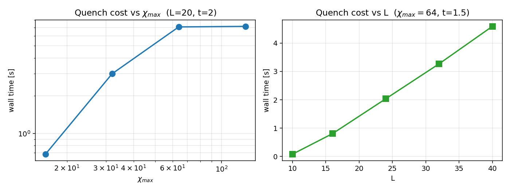

# Milestone 2 — Design Report
## GPU-Accelerated TEBD for the 1D Transverse-Field Ising Model

**Team:** Xin Wei, Chiling Han, Hercy Shen
**Course:** CME 213, Spring 2026

---

## 1. Project scope

We are building a GPU TEBD solver for real-time dynamics of the 1D
transverse-field Ising model

```
H = -J ∑ σ^x_i σ^x_{i+1}  -  g ∑ σ^z_i
```

evolved from a product state on a Matrix Product State (MPS).

The user gives us `L`, `(J, g)`, an initial product state, `dt`, `t_max`,
maximum bond dimension `χ_max`, and Trotter order. We return the time
series of magnetisations `⟨σ^z_i⟩`, `⟨σ^x_i⟩`, two-point correlations,
bipartite entanglement entropy on every cut, the bond-dimension profile,
and the accumulated SVD truncation error.

We assume open boundaries, `d = 2`, nearest-neighbour bonds, and a
hand-written one-sided Jacobi SVD (no LAPACK). The project is a success
if the CUDA TEBD reproduces our CPU reference against exact
diagonalisation to machine precision and shows a clear speed-up on
`update_bond` once `χ ≳ 32`. A multi-GPU mode for parameter sweeps via
MPI is the M4 stretch goal.

**Status at M2.** The CPU reference is complete. All 54 unit tests
pass. Against ED on `L = 8`, `dt = 0.05`, order 4, the final fidelity
drop is `4.3 × 10⁻¹¹` (Sec. 6).

## 2. Related work

The MPS / TEBD foundations are Vidal's original paper and Schollwöck's
review. Mature CPU/Python implementations include TeNPy, ITensor, quimb,
and TensorNetwork. Our CPU reference uses the right-canonical Vidal-B
form and the gate-cache structure from TeNPy.

GPU TEBD is less standardised. NVIDIA's cuTensorNet provides batched
contractions and SVD on a single GPU, and ITensor supports MPI for
independent runs. We are not advancing the state of the art: the goal is
a clean, instrumented TEBD where every kernel is visible, so we can
attribute time to gate contraction, SVD, and memory traffic without
hiding behind a library. Our parallel one-sided Jacobi SVD follows the
Brent–Luk pattern; the Trotter splitting follows Hatano–Suzuki.

## 3. Computational challenges

**SVD is the bottleneck.** Each TEBD sub-step performs `L − 1` complex
SVDs of size up to `2χ × 2χ`. We use one-sided Jacobi: non-overlapping
column pairs are independent within a sweep, which maps cleanly to
thread blocks. Convergence is data-dependent (5–10 sweeps in practice),
so load balancing across bonds is non-trivial.

**Tensor transposes are memory-bound.** `update_bond` permutes
`(2χ)² · d²` complex doubles per bond inside `tensor_contract`. The
permutation order matters for coalescing on the GPU.

**Bond dimension saturates the budget.** Our quench data (fig. 1) show
the actual `χ(t)` rising to `χ_max = 64` at `t ≈ 1.9` and the
truncation error crossing `10⁻⁶` near `t ≈ 3.85`. Cost per bond scales
as `O(χ³)`, so doubling the *effective* bond dimension is an 8× hit.
Pre-allocating to `χ_max · d · χ_max` (already done) avoids
`cudaMalloc` during evolution.


*Figure 1. L = 20 quench under TFIM (J = g = 1, dt = 0.05, order 4,
χ_max = 64). Mid-bond entropy grows linearly; bond dimension saturates
at χ_max around t ≈ 1.9; truncation error crosses 10⁻⁶ near t ≈ 3.85.*

**Single-chain parallelism is limited.** Even and odd bonds within a
sub-step are independent — `(L − 1)/2`-way parallelism, useful on a
single GPU but limiting for strong-scaling across multiple GPUs on one
chain.

## 4. CUDA implementation plan

The CPU reference was built module-by-module to be CUDA-portable.

| CPU routine        | GPU implementation |
|---|---|
| `zgemm`            | tiled shared-memory kernel; `cublasZgemm` reference |
| `tensor_contract`  | transpose kernel + `zgemm` |
| `svd` (Jacobi)     | one block per non-overlapping column pair; sweep loop on host |
| `update_bond`      | fused kernel: gate contraction → SVD → truncation → Vidal restore |

The hot kernel is `update_bond`: even-parity bonds within one Trotter
sub-step are independent, so we launch them as a single grid with one
block per bond. `Tensor` already pre-allocates to `χ_max`, so device
buffers are allocated once at engine construction.

## 5. MPI implementation plan

Single-chain TEBD has limited spatial parallelism, so MPI distributes
**independent runs** — sweeps over `(J, g)`, `χ_max`, or `dt`. Each rank
owns one GPU and runs an independent `TEBDEngine`; rank 0 gathers
results. Embarrassingly parallel, clean weak-scaling.


## 6. Profiling and performance analysis plan

**Correctness baseline (already collected).** TEBD vs. ED on
`L = 8, dt = 0.05, t = 2`, order 4, `χ_max = 64`:

| observable                  | max error |
|---|---|
| `⟨σ^z_i⟩`                   | 5.1 × 10⁻⁶ |
| `⟨σ^x_i⟩`                   | 0 (symmetry) |
| `⟨σ^x_i σ^x_j⟩`             | 4.7 × 10⁻⁶ |
| `S_b`                       | 2.2 × 10⁻⁶ |
| `1 − \|⟨ψ_TEBD\|ψ_ED⟩\|`    | 4.3 × 10⁻¹¹ |

The error is dominated by `dt^4` Trotter error at this `dt`.


*Figure 2. Per-step max error of TEBD against exact diagonalisation.
After the first step the error sits at the Trotter floor (~10⁻⁶) and
stays there for the entire run; final state-vector fidelity loss is
4.3 × 10⁻¹¹.*

**CPU runtime baseline (already collected).** `L = 20, dt = 0.05, t = 2`,
order 4:

| `χ_max` | wall (s) |
|---|---|
| 16   | 0.68 |
| 32   | 2.99 |
| 64   | 7.06 |
| 128  | 7.13 |

The 16→32→64 progression is consistent with the expected `O(χ³)`
scaling. The plateau at `χ_max ≥ 64` requires a careful explanation:
`χ_max` is only an *upper bound* on the bond dimension, not its actual
value. The cost of each `update_bond` is governed by the *current*
bond dimension `χ_actual(t)`, since the SVD operates on a `2χ_actual ×
2χ_actual` matrix. From fig. 1, `χ_actual(t)` reaches the cap of 64
only at `t ≈ 1.9`, so for the entire `t ∈ [0, 2]` window the running
SVDs are at most 128 × 128 — and raising `χ_max` to 128 cannot make
those matrices any larger. The only effect of a larger `χ_max` is more
pre-allocated memory and fewer truncation events, neither of which adds
compute. If we extended the run past `t ≈ 2`, the `χ_max = 64` curve
would stay flat (capped) while the `χ_max = 128` curve would keep
growing as `χ_actual` continued to climb — and the runtime gap would
open. Linear scaling in `L` is observed at fixed `χ_max`.



*Figure 3. Wall time vs χ_max (left, log–log) and vs L (right). Cubic
scaling at small χ_max; flat once `χ_actual(t)` is the binding
dimension. Linear in L at fixed χ_max.*

**Experiments planned for M3 (CUDA):**

- per-kernel timing breakdown via Nsight Systems (`gate_apply`, `svd`,
  `vidal_restore`, host↔device transfers);
- roofline of `update_bond` via Nsight Compute, classifying each kernel
  as compute- or memory-bound;
- CPU vs. GPU speed-up curve over `χ_max ∈ {16, 32, 64, 128, 256}`;
- Jacobi-SVD sweep count vs. residual;
- peak device memory; verify zero `cudaMalloc` during evolution.

**Experiments planned for M4 (MPI):**

- weak scaling on the embarrassingly-parallel parameter-sweep mode for
  `n_GPU ∈ {1, 2, 4, 8}`;
- (stretch) strong scaling for spatial decomposition at `L = 64`.

What we hope to learn: (i) is single-chain TEBD compute-bound (SVD) or
memory-bound (transposes) on a modern GPU? (ii) does Jacobi SVD remain
practical at `χ = 256`, or do we need a randomised SVD? (iii) is
spatial MPI decomposition worth the complexity, or is sweep-parallelism
the only useful mode?

## 7. Timeline

- **M3 — GPU kernels (due May 11):** CUDA build setup; port
  `Tensor` / `TensorAccessor`, `zgemm`, `tensor_contract`; port
  Jacobi `svd` and the fused `update_bond` kernel; re-run all unit tests
  and `validate_tebd_vs_ed` on the GPU path.
- **Profiling & tuning:** Nsight timing breakdown, roofline analysis,
  optimise the dominant kernel, generate CPU-vs-GPU speed-up curves.
- **M4 — Distributed (due May 27):** MPI parameter-sweep mode and
  weak-scaling numbers; if time allows, prototype spatial decomposition
  on `L = 64`.
- **Final report (due Jun 8):** larger physics sweep across the TFIM
  phase diagram, write-up, buffer for debugging.

Risks: if Jacobi SVD underperforms cuSOLVER's batched SVD at large `χ`,
we keep the Jacobi kernel as the hand-written deliverable but switch
the production path to `cusolverDnZgesvdjBatched`. If spatial MPI proves
unproductive, parameter-sweep mode is the guaranteed fallback.
